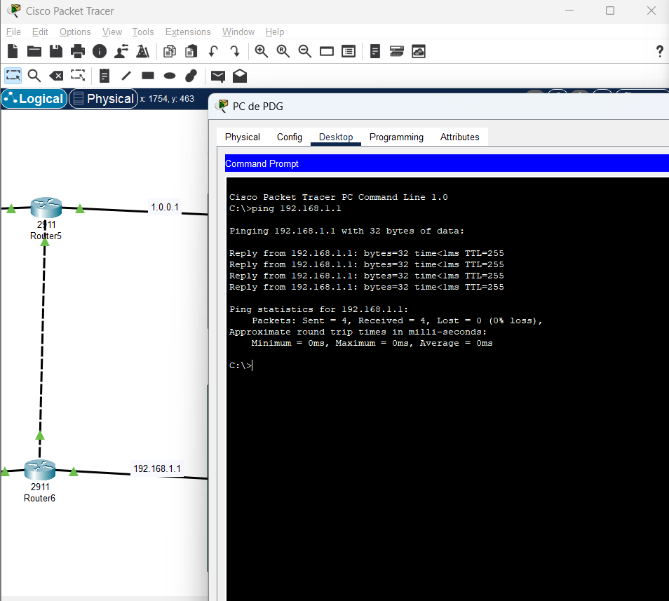
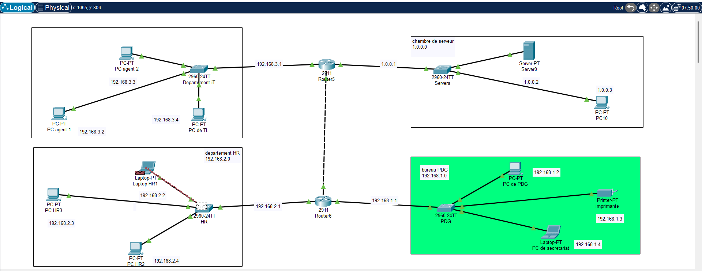

# Grand devoir - Ayad CHEKHAB reseaux des systemes S1
For Project, Cisco Packet Tracer lab that simulates a small office network with multiple departments, routers, switches, PCs, printers, and a server.  
## Screenshots:

## Topology Overview

The network is divided into several subnets:

- Chairman network: `192.168.1.0/24`
- HR Department network: `192.168.2.0/24`
- IT Department network: `192.168.3.0/24`
- Server Room network: `1.0.0.0/24`
- Router-to-router link: `10.0.0.0/24`
Each subnet has its own switch and default gateway on a router interface.

## Requirements

- Cisco Packet Tracer 8.x or later
- Basic knowledge of:
  - IP addressing and subnet masks
  - Using the CLI on Cisco routers and switches
  - Ping and basic connectivity tests

## What You Can Practice

- Checking device configurations (PCs, routers, switches).
- Configuring IP addresses on router interfaces.
- Configuring static routes between routers.
- Setting IP addresses and default gateways on PCs and servers.
- Testing connectivity using `ping` and fixing routing or IP errors.

## Suggested Tasks

1. Verify the IP address and default gateway on each PC and server.
2. On each router, use `show ip interface brief` to confirm interfaces are up.
3. Configure or review static routes so all subnets can reach each other.
4. From the Chairman PC, try to ping a PC in the IT Department and the server.
5. Try to intentionally break something (wrong IP, wrong gateway) and then fix it.

